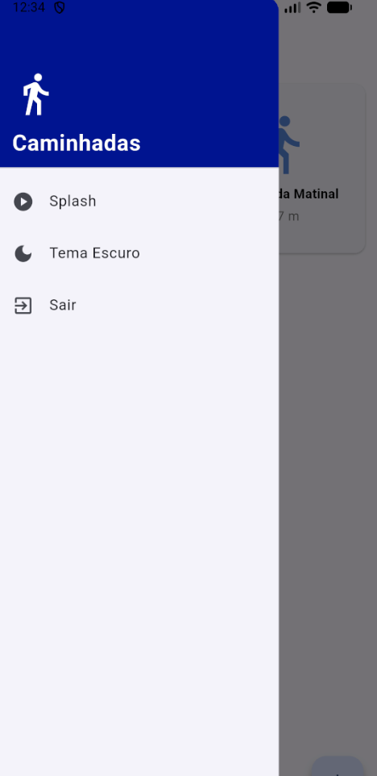
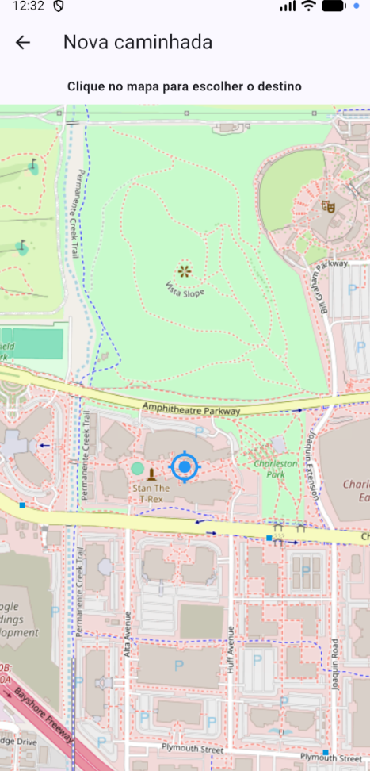
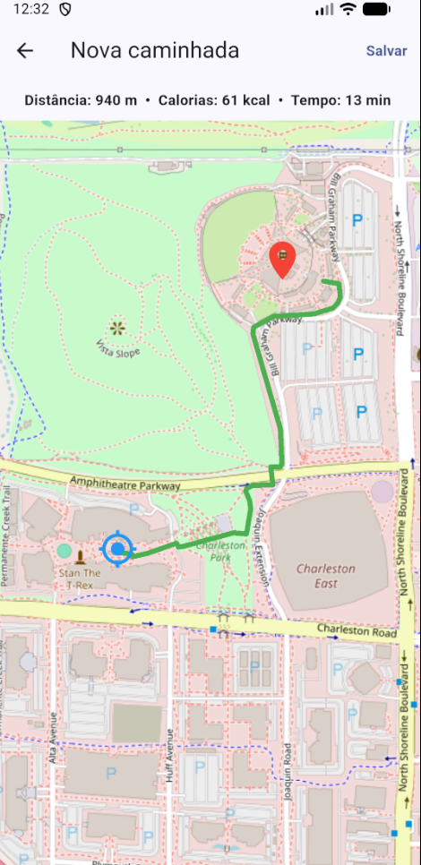
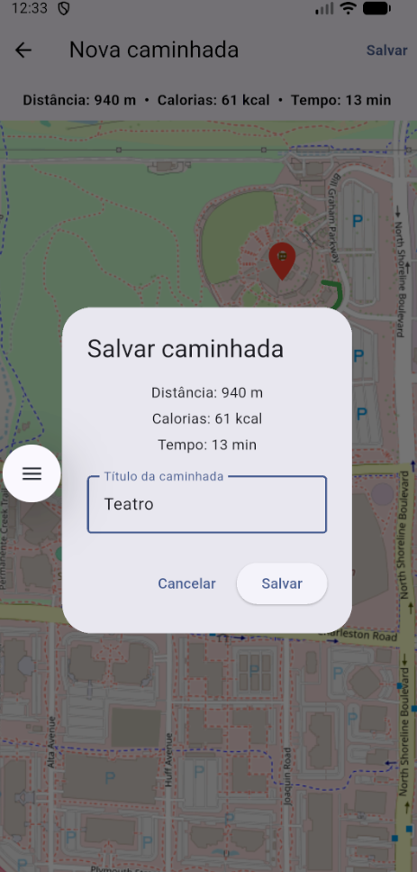
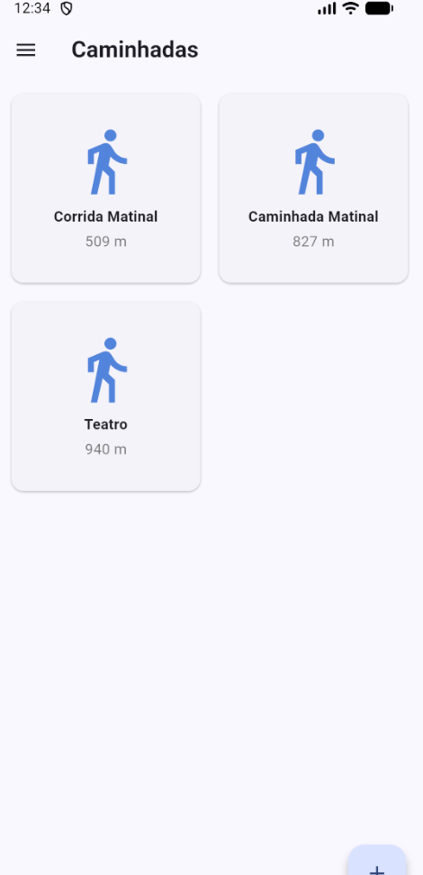

# 🚶 App de Caminhadas

Aplicativo desenvolvido em **Flutter** com o objetivo de registrar caminhadas e acompanhar informações relacionadas à atividade.

## 📱 Sobre o projeto

O App de Caminhadas foi desenvolvido como um desafio utilizando Flutter. A proposta é criar uma aplicação simples para registrar caminhadas e apresentar informações da atividade de forma organizada.

## 🛠️ Tecnologias utilizadas

* Flutter
* Dart
* Android Studio
* Emulador Android

## ✨ Funcionalidades

* Registro de caminhadas;
* Cálculo de calorias;
* Exibição das informações da caminhada;
* Tela inicial com Splash Screen;
* Interface simples e fácil de utilizar.


## 🖼️ Telas do aplicativo

### Splash Screen



### Tela principal



### Tela Trajeto



### Tela Cadastro Caminhada



### Tela Caminhadas



## ▶️ Como executar o projeto

1. Clone este repositório:

```bash
git clone https://github.com/MIRELLA-02/appcaminhada.git
```

2. Instale as dependências:

```bash
flutter pub get
```

3. Execute o aplicativo:

```bash
flutter run
```

Também é possível executar o projeto utilizando um **emulador Android**.

## 📦 APK

O APK do aplicativo será disponibilizado na pasta:

```text
build/app/outputs/flutter-apk/app-release.apk
```

## 👩‍💻 Desenvolvido por

**Mirella Brolezi**

